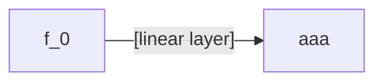

1. 街景图片Embedding的提取
我们构建了一个简单的MLP（Multilayer Perceptron）神经网络。
在训练过程中，我们将街景图片五个维度的特征（greenery and street scale, facade material, architectural style, urban sign, building color），以交叉熵损失（cross entropy loss）为loss函数，将该MLP训练为对通过街景照片的特征预测出所属city的预测模型。
在模型训练完成后。我借助模型倒数第二层线性层（linear layer）的输出，作为输入街景图片的embedding。

2. 数据的降维
我们使用tsne的方法对街景图片的embedding进行降维，降维为一个二维向量，即它们在散点图上的位置。
街景照片embedding的余弦相似度，即为它们之间的相似度。

